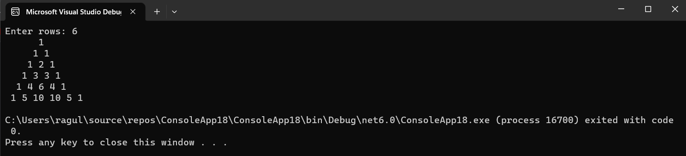

# Pattern

## Aim:
To write a C# program for a pascal's triangle.

## Equipment Required:
Microsoft Visual Studio 2022.

## Algorithm:
## step 1:
1.Start the program.
## step 2:
2.Get the limit from the user,use for loop to print the rows ,columns and space.
## step 3:
3.Use condition inside the loop to print the values.
## step 4:
4.Print the Pascal's triangle.
## step 5:
5.End the program.

## Program:
~~~c#
using System;
namespace Pattern
{
    public class program
    {
        public static void Main(string[] args)
        {
            int row, c = 1;

            Console.Write("Enter rows: ");
            row = Convert.ToInt32(Console.ReadLine());

            for (int i = 0; i < row; i++)
            {
                for (int j = 1; j <= row - i; j++)

                    Console.Write(" ");

                for (int j = 0; j <= i; j++)
                {
                    if (j == 0 || i == 0)

                        c = 1;

                    else
                        c = c * (i - j + 1) / j;

                    Console.Write("{0} ", c);
                }
                Console.WriteLine();
            }
        }
    }
}
~~~

## Output:

## Result:
A C# program for a pascal's triangle is executed successfully.
